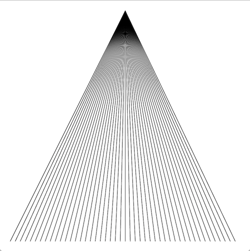
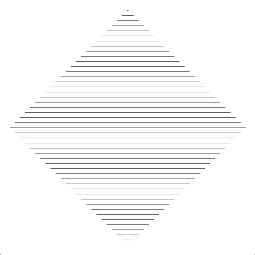

### Homework 3 (due Friday, February 9, 2018)

This homework has two parts; first, complete the p5.js loops practice and explore some user interaction concepts. Second, share your solutions with someone else from class and ask them to to provide feedback on your work!

#### p5.js Loops & Interactivity

1. **Assginment**: `patch.js` -- complete your quilt patch from class. Your function should be named something unique ending in `patch`, e.g., `function jdPatch(x, y)`. Follow the [instructions we used in class](https://github.com/zamfi/cca-programming-electronics-spring-2018/blob/master/README.md#class-quilt) to create your patch. Upload your patch to your `hw3` [github](http://github.com/zamfi/github-guide) in a file called `patch.js`.

2.  **Assignment**: Recreate the images from our in-class loops workshop. Name them in your repository as labeled below.

    Before starting this exercise, watch Daniel Shiffman's video tutorials about [`while` and `for` loops](https://www.youtube.com/watch?v=cnRD9o6odjk) and [nested loops](https://www.youtube.com/watch?v=1c1_TMdf8b8). This will help reinforce what we learned in class today.
    
    1.  `vertical-lines.js` -- first, some vertical lines:
        
        

    2.  `horizontal-lines.js` -- next, make horizontal lines:
    
        
        
    3.  `concentric-circles.js` -- try these concentric circles too:
        
        

    4.  `cone-of-lines.js` -- and this cone:
        
        
    
    5.  `diamond-lines.js` -- also this diamond:
        
        
    
    6.  `taller-lines.js` -- what about these taller lines?
        
        
    
    7.  **Optional Challenge**: `art-deco.js` -- for this you'll need a **loop within a loop**:
        
        

    8.  **Optional Challenge**: `circle-grid.js` -- now try this grid of circles; you'll need **nested loops** for this one too!
        
        

    9.  **Optional Extra Challenge:** `easing.js` -- using a technique called the "exponential moving average", we can create a smooth easing animation like this:
        
        
        
        The technique works by one variable to store intermediate values for another variable. For example, in the sketch above, the *x-* and *y-* coordinates of the circle are stored in variables `x` and `y`, which are **eased** to the target values given by `mouseX` and `mouseY`.
        
        "Exponential moving average" is a fancy way of saying: first, pick a fixed **rate** at which the easing occurs for a variable reaching its target. That rate controls how much impact the target has on the value each frame. For exampe, if the rate is 10%, then the new value each frame is 10% the target value and 90% the old value of the variable. Here's some sample code; the key is in the line `x = target*rate + x*(1-rate);`:
        
        ```javascript    
        var rate = 0.1;
        var x = 0;
        var target = 100;
        
        while (true) {
          ellipse(x, 100, 15, 15);
          x = target*rate + x*(1-rate); // rate is 0.1, or 10% -- (1-rate) is 0.9, or 90%
        }
        ```
        
        Each frame, x gets 10% closer to its target.
        
        Modify this code to create a circle that follows the mouse as in the anigif above.

3.  **Assignemnt**: Pick 3 of Sol LeWitt's *Wall Drawings* from [this retrospective at MASS MoCA](http://massmoca.org/sol-lewitt/) and reproduce them using code. Label these in your [homework repository](http://github.com/zamfi/github-guide) according to their title in the restrospective, e.g., `lewitt-368.js`. Feel free to use the image as your guide or LeWitt's instructions directly. More info about [Sol LeWitt's instructions here](http://risdmuseum.org/manual/45_variations_of_a_drawing_sol_lewitt_and_his_written_instructions).
    
    Get creative! Use whatever code you're comfortable with. Bonus points for doing more than 3, or for animating them in some way.
    
    You may also find interesting Casey Reas' [{Software} Structures](http://artport.whitney.org/commissions/softwarestructures/map.html).    
    
4.  Re-watch Daniel Shiffman's video on [variables](https://www.youtube.com/watch?v=RnS0YNuLfQQ), paying special attention to the last 4 minutes where he describes using `mouseX`, `mouseY`, and the `mousePressed()` function. Next week, we'll learn about user inputs; practice with the code below.
    
    At this point, we're ready to graduate to the official p5.js web editor, instead of Rudy. You can use the official, bleeding-edge version run by the p5.js people at [alpha.editor.p5js.org](http://alpha.editor.p5js.org); or you can use the less-bleeding-edge but perhaps more stable copy I run on my server at [p5js.zamfi.net](http://p5js.zamfi.net). In either case, make sure to make an account for yourself!
    
    First, run this code in p5:
    
    ```javascript
    function setup() { 
      createCanvas(400, 400);
    } 

    var diameter = 10;

    function draw() { 
      ellipse(mouseX, mouseY, diameter);
    }
    ```
    
    What does this code do? Remember that p5 starts by running your `setup` function, then runs `draw` in response to every frame request from your computer/browser. Running this code, each frame, p5 draws a circle centered on the mouse cursor.
    
    Next, consider the following slight modification:
    
    ```javascript
    function setup() { 
      createCanvas(400, 400);
    } 

    var diameter = 10;

    function draw() { 
      if (mouseIsPressed) {
        ellipse(mouseX, mouseY, diameter);
      }
    }
    ```
    
    What changed? We added an `if` condition around the `ellipse` function call. What effect does that have? What do you think the `mouseIsPressed` variable does?
    
    Lastly, consider the following addition:
    
    ```javascript
    function setup() { 
      createCanvas(400, 400);
    } 

    var diameter = 10;

    function draw() { 
      if (mouseIsPressed) {
        ellipse(mouseX, mouseY, diameter);
      }
    }

    function keyPressed() {
      print(key);
      if (key == 'R') {
        fill(255, 0, 0);
      } else if (key == 'G') {
        fill(0, 255, 0);
      } else if (key == 'B') {
        fill(0, 0, 255); 
      }
    }
    ```
    
    When running the above code, you may have to click on the p5 canvas before it recognizes keypresses.
    
    The `keyPressed` function, like the `setup` and `draw` functions, is **called for you** by the p5.js environment, every time the user presses a key. This style of programming, where you write functions that get triggered by certain **events**, is called **event-driven programming**--it is extremely common.
    
    Inside the `keyPressed` function, the value of the `key` variable is the latest key that the user has pressed. The code above takes advantage of this to call the `fill` function to make any subsequent drawing commands fill with red, green, or blue, depending on which key is pressed.
    
    **Assignment**: `drawing-new-colors.js` -- the stark red, green, and blue colors are Kinda Garish™. Improve them! Use more pleasing colors. Then, **add 3 more colors** to the list, by adding on additional `else if` clauses following the pattern in the code. Use whatever letters you wish to set those colors.
    
    **Assignment**: `drawing-with-diameter.js` -- add `else if` clauses for keys `1`, `2`, and `3`, which modify the `diameter` variable to change the size of the "paintbrush".
    
    **Optional Challenge**: `drawing-eraser.js` -- add an "eraser" key! This key should switch the "paintbrush" to be an eraser.
    
    **Optional Challenge**: `drawing-indicator.js` -- add an "indicator" icon that shows the current color & size of the paintbrush. Perhaps a circle in the lower-right corner that has the same color and size as the current paintbrush?
    
#### Sharing & Caring (due Monday before class)

You'll receive a link from me or Lei for someone else's homework.

- When you receive a link to evaluate, look at each program and try running it. Does it work as you expect? Is it easy to understand the code?

- If it doesn't, file a "bug report"!

  - Click the "Issues" tab at the top of the github page, and create a new issue with the bug you found. Make sure to include the puzzle number and what you think is going on, so the author can fix their code.
